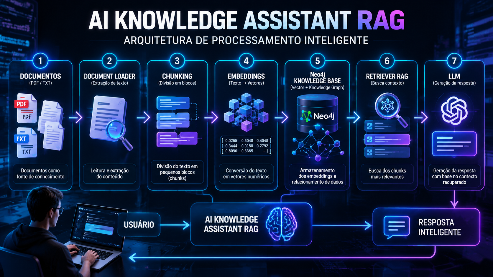
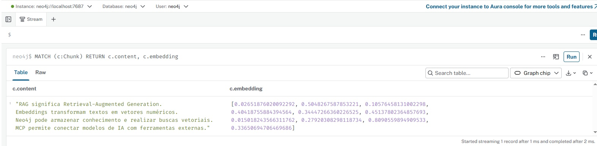
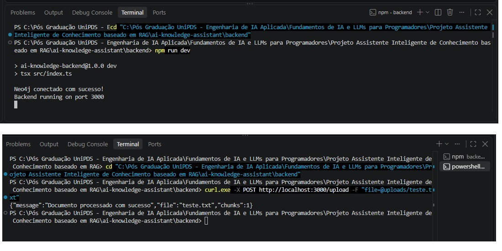

# 🤖 AI Knowledge Assistant RAG

<p align="center">
  
</p>

<p align="center">
  Assistente inteligente baseado em arquitetura RAG (Retrieval-Augmented Generation),
  utilizando Embeddings, Neo4j, MCP e LLMs.
</p>

---

# 📌 Sobre o Projeto

O **AI Knowledge Assistant RAG** é um projeto de portfólio desenvolvido para demonstrar
a aplicação prática de conceitos modernos de **Engenharia de Software aplicada à Inteligência Artificial**.

O projeto explora como sistemas inteligentes podem transformar documentos em uma base
de conhecimento consultável utilizando técnicas de:

- Large Language Models (LLMs);
- Retrieval-Augmented Generation (RAG);
- Embeddings;
- Busca semântica;
- Knowledge Graph;
- Integração entre aplicações e ferramentas de IA.

---

# 🎯 Objetivo

Construir uma arquitetura de assistente inteligente capaz de:

- Receber documentos como fonte de conhecimento;
- Processar e extrair informações relevantes;
- Dividir conteúdos em pequenos blocos (**chunks**);
- Preparar representações vetoriais (**embeddings**);
- Armazenar conhecimento utilizando Neo4j;
- Criar uma base preparada para consultas inteligentes utilizando LLMs.

---

# 🏗️ Arquitetura do Sistema

<p align="center">
  
</p>


Fluxo da aplicação:

```text
Usuário
   |
   v
Frontend (React + Vite)
   |
   v
Backend (Node.js + TypeScript)
   |
   v
Pipeline RAG

   |
   +--> Document Loader
   |
   +--> Chunking
   |
   +--> Embeddings
   |
   v

Neo4j Knowledge Base

   |
   v

LLM Response
```

---

# 🚀 Tecnologias Utilizadas

## Backend

- Node.js
- TypeScript
- Express

## Frontend

- React
- Vite

## Inteligência Artificial

- RAG (Retrieval-Augmented Generation)
- Embeddings
- LLM Integration
- MCP (Model Context Protocol)

## Banco de Conhecimento

- Neo4j
- Knowledge Graph
- Vector Storage

## Infraestrutura

- Docker
- Docker Compose

---

# 📂 Estrutura do Projeto

```text
ai-knowledge-assistant

│
├── backend
│   │
│   └── src
│       ├── database
│       ├── documents
│       ├── embeddings
│       ├── mcp
│       ├── rag
│       ├── routes
│       └── vector
│
├── frontend
│
├── docs
│   │
│   └── imagens
│       ├── ai-knowledge-assistant-banner.png
│       ├── architecture-rag.png
│       ├── neo4j-chunks.jpg
│       └── upload-success.png
│
├── docker-compose.yml
│
├── README.md
│
└── .env.example
```

---

# ⚙️ Como Executar

## 1. Configurar variáveis de ambiente

Copie o arquivo:

```bash
.env.example
```

para:

```bash
.env
```

Configure suas variáveis:

```env
NEO4J_URI=bolt://localhost:7687
NEO4J_USER=neo4j
NEO4J_PASSWORD=password
```

---

# 🐳 2. Iniciar o Neo4j

Execute:

```bash
docker compose up -d
```

O Neo4j ficará disponível:

```
http://localhost:7474
```

---

# ⚙️ 3. Executar Backend

Entre na pasta:

```bash
cd backend
```

Instale as dependências:

```bash
npm install
```

Execute:

```bash
npm run dev
```

Backend:

```
http://localhost:3000
```

---

# 📤 Upload de Documento

O sistema permite enviar documentos para processamento.

Endpoint:

```
POST /upload
```

Exemplo:

```bash
curl.exe -X POST http://localhost:3000/upload -F "file=@uploads/teste.txt"
```

Resposta:

```json
{
  "message": "Documento processado com sucesso",
  "file": "teste.txt",
  "chunks": 1
}
```

---

# 🧠 Processamento RAG

O fluxo de conhecimento:

```
Documento
    |
    v
Extração de texto
    |
    v
Chunking
    |
    v
Embeddings
    |
    v
Neo4j
    |
    v
Recuperação de contexto
    |
    v
LLM
    |
    v
Resposta inteligente
```

---

# 🗄️ Neo4j Knowledge Storage

Exemplo de consulta:

```cypher
MATCH (c:Chunk)
RETURN c.content, c.embedding
```

Resultado esperado:

<p align="center">
  
</p>

---

# 📸 Demonstração

## Upload funcionando

<p align="center">
  
</p>

---

# 🧩 Conceitos Aplicados

## RAG

Retrieval-Augmented Generation combina recuperação de informações
com geração utilizando modelos de linguagem.

## Embeddings

Transformação de textos em vetores numéricos permitindo comparação,
representação e busca semântica.

## Neo4j

Utilizado como base de conhecimento para armazenamento das informações
processadas e relacionamento entre dados.

---

# 🚧 Roadmap

- [x] Estrutura inicial do backend
- [x] Integração com Neo4j
- [x] Upload de documentos
- [x] Extração de texto
- [x] Chunking
- [x] Estrutura de embeddings
- [ ] Busca vetorial avançada
- [ ] Integração completa com LLM
- [ ] Interface conversacional
- [ ] Autenticação de usuários
- [ ] Deploy em Cloud

---

# 🎓 Formação

Projeto desenvolvido durante a pós-graduação:

## Engenharia de Software em IA Aplicada

Módulo:

## Fundamentos de IA e LLMs para Programadores

---

# 👨‍💻 Autor

Desenvolvido como projeto de estudo e portfólio em Engenharia de Inteligência Artificial.
